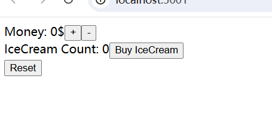

# Redux Toolkit Example

Redux Toolkit 极简示例：Let's buy some ice-cream!

This project was bootstrapped with [Create React App](https://github.com/facebook/create-react-app).

## 0. 在开始前

## 0.1 项目说明

本项目将以案例的方式介绍 Redux Toolkit 的使用方法，包括：

- 创建和使用 Redux store、Redux state slice；
- 编写 reducer 函数；
- 使用 useSelector 和 useDispatch 钩子函数在 React 组件中使用 Redux 进行状态管理；
- 以及在 reducer 函数中使用复杂更新逻辑。

### 0.2 项目介绍

本项目将实现一个非常简单的 React 单页应用。应用的页面将显示：
- 用户所拥有的金钱和冰激凌的数量；
- 两个能让用户增加或者减少金钱的按钮；
- 一个购买冰激凌的按钮；
- 以及一个重置按钮。

在按下任意按钮时，页面上显示的信息将及时更新。如图所示：

**本项目将从添加了页面信息和按钮的模版代码开始**，模版代码可以拉取本项目 ChapterZero 分支获取。